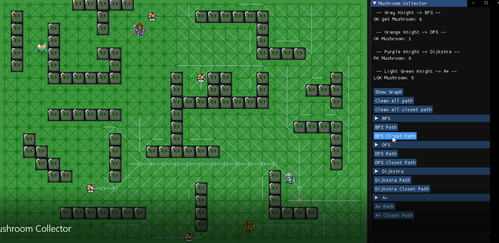

#Mushroom Collector
> AI Pathfinding Simulation  
>July 2019 - September 2019 (C++, Custom Engine)
-	Implemented search algorithms including BFS, DFS, Dijkstra, A Star and used autonomous agents to compare the results.
-	Used ImGui to implement UI options for debugging/testing.

